# Technologies and App Architecture

## Server Side

- Go Lang
- Gokit - Microservice friendly toolkit
- Goram - ORM
- Docker - App Containerization
- Database - Postgres
- Database migration - Flyway
- JWT base auth
- Microservice friendly structure

## Client Side

- React
- Redux
- Material UI

## How To run

Please make sure you have docker running in your machine and docker-compose command is working.

```
git clone https://github.com/narenrana/cnm-retail.git
cd cnm-retail
docker-compose build && docker-compose  up
```

Open `http://localhost:3500`

## Project Architecture

Each app can be independent and can be deployed and scaled individually .

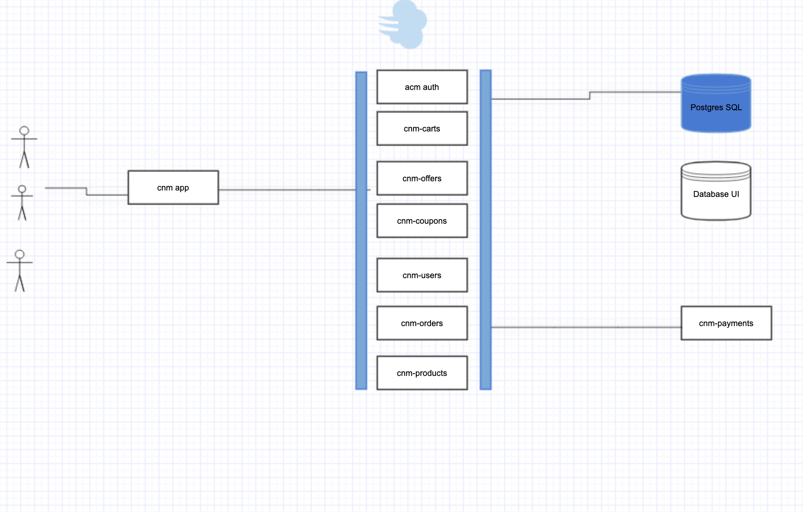

## Database diagram

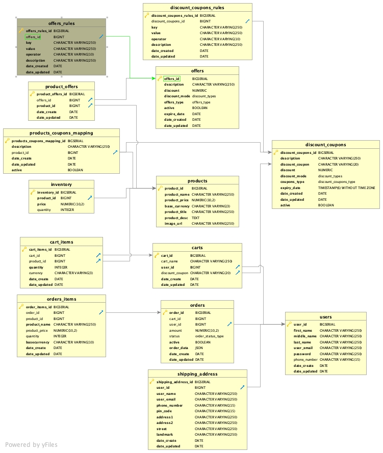

Offers are configurable . Admin can specify promotional offers in the database and what rules it holds to apply on buyings.

Coupons are also configurables .Admin can define coupon promotions and coupon rules in coupon rules tables.

### UI APP

Login Screen

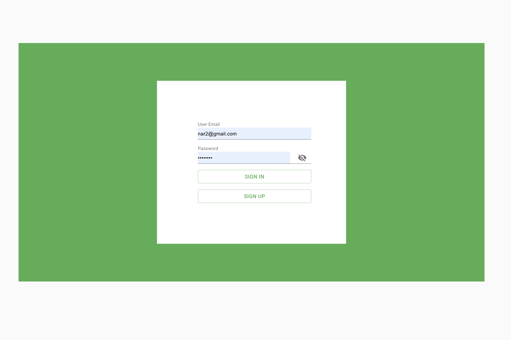

Sign Up Page

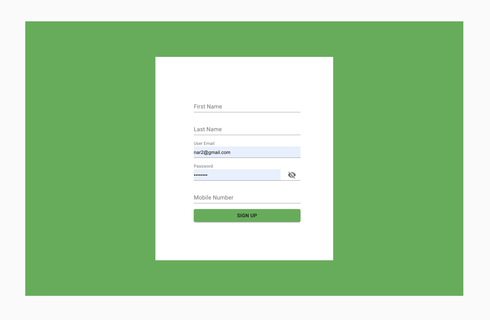

Product Home Page

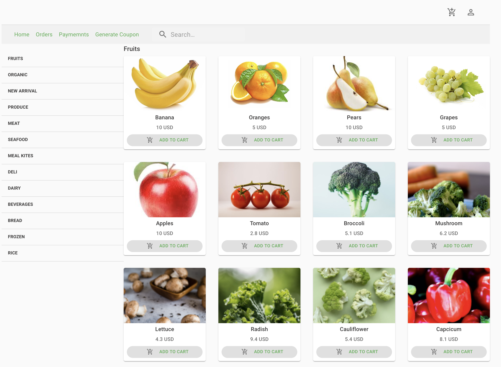

Add items in cart
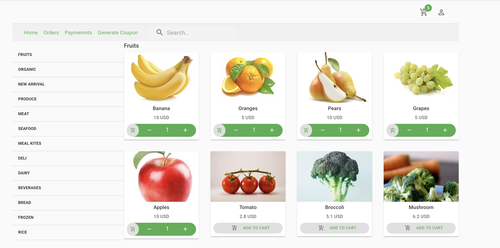

Checkout page

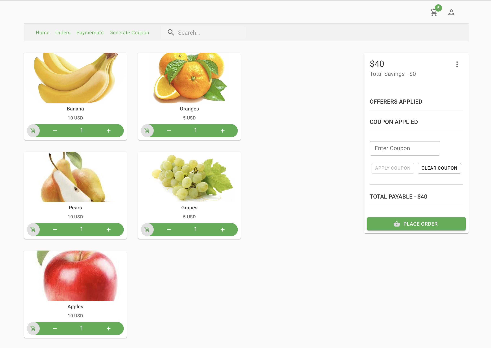

4 Pears and 2 banana scenario- 30 % discount on items
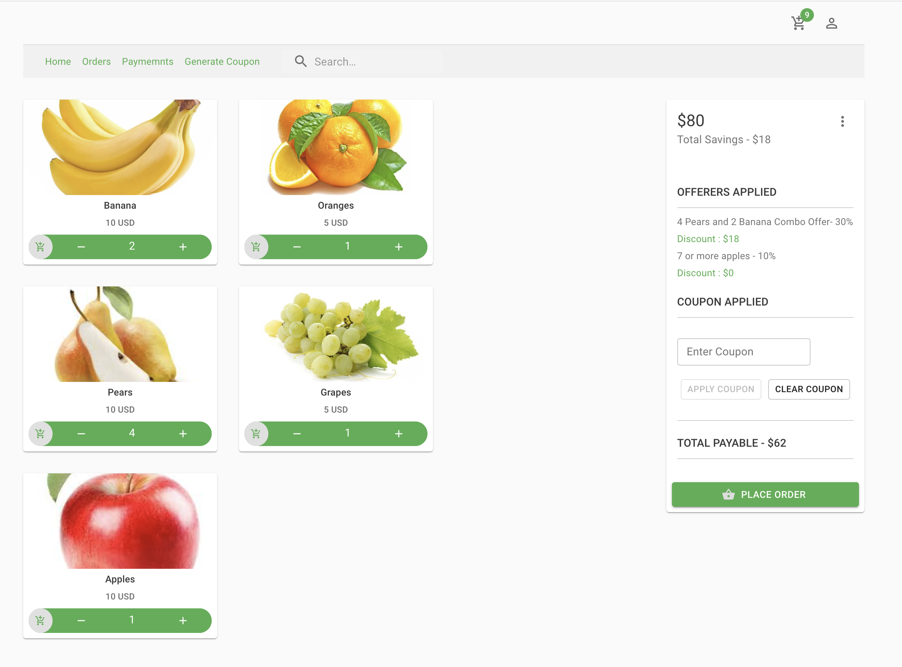

7 or more apple added in cart- 10% discount on apples
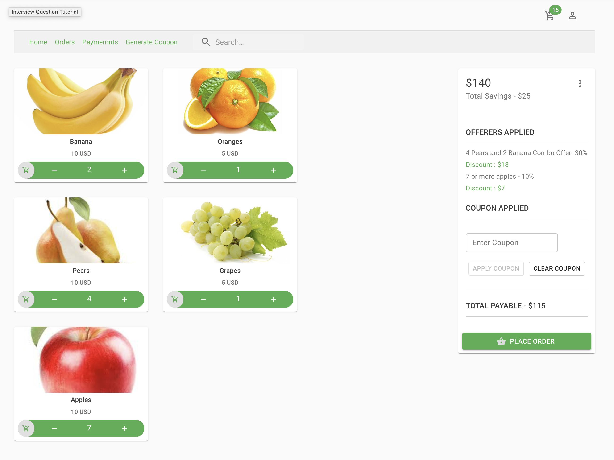

Apply a coupon DIS237890WR to get 30 % discount on oranges

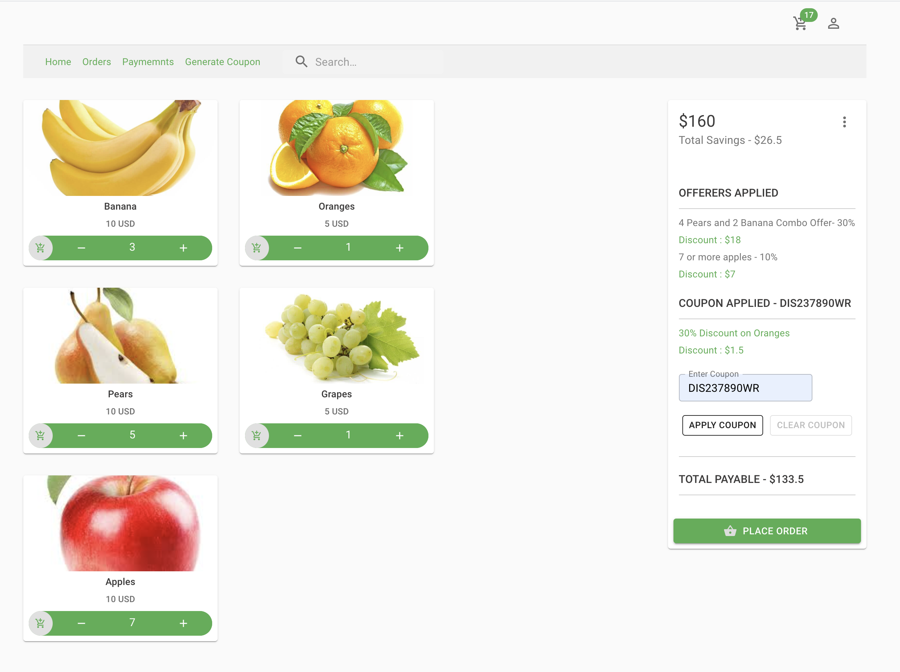

For Demonstration purpose user can generate coupon valid for 10 or more seconds from
Coupon page

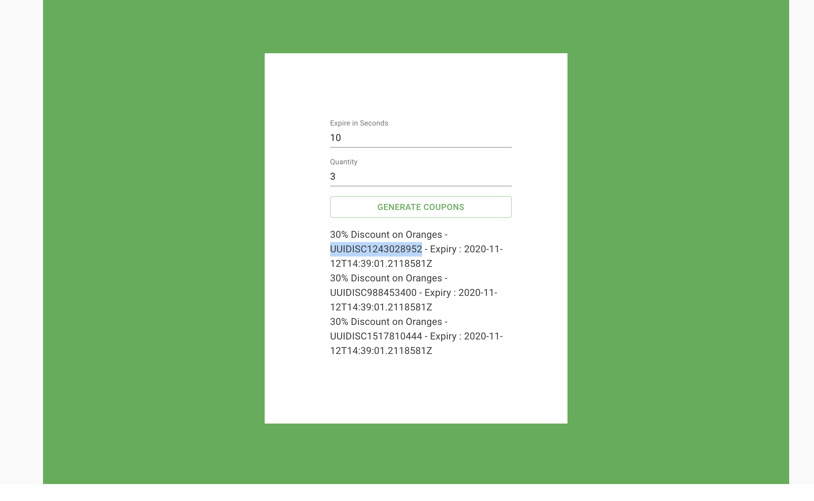

Fake Payment page
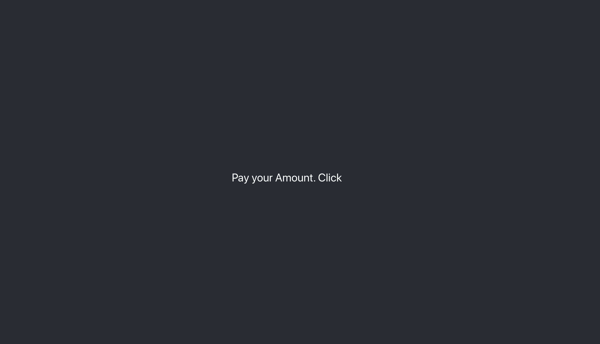

Placed order
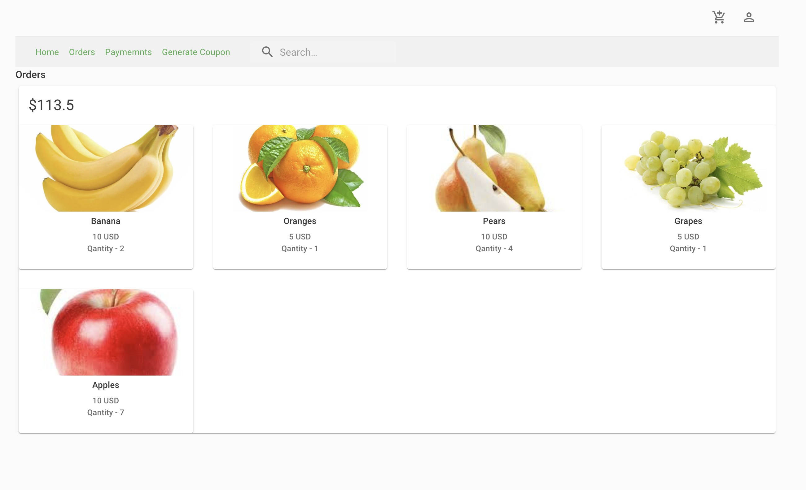
